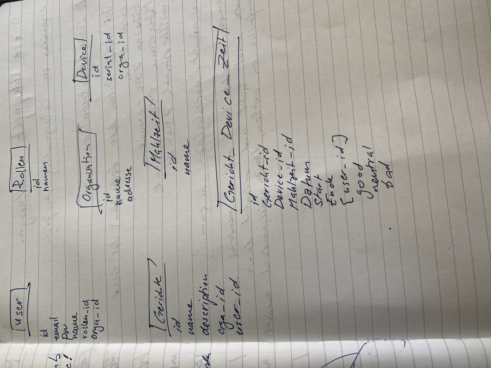

## Kurzbeschreibung des Projekts

•⁠  ⁠*Modul:* Interaktive Medien 4 an der Fachhochschule Graubünden (FS26)  
•⁠  ⁠*Themenfeld:* IoT-Applikation zum Thema Eltern mit kleinen Kindern  
•⁠  ⁠*Name des Projekts:* YumYum Feedback  
•⁠  ⁠*Team Physical Computing:* Lorena Simonelli & Sheyla Spiess  
•⁠  ⁠*Team WebApp:* Aarti Miescher & Tamara Kae Marzan

**Welches Problem im Alltag von Eltern mit kleinen Kindern wird gelöst?**
In Kitas und Familien ist es oft schwierig, objektives Feedback von Kleinkindern zum Essen zu erhalten. Verbale Kommunikation ist in diesem Alter oft unpräzise und die tatsächliche Akzeptanz von Mahlzeiten bleibt für Eltern und Küchenpersonal unklar. Dies führt zu unnötigem Food Waste, da die Menüplanung nicht optimal auf die Bedürfnisse der Kinder abgestimmt ist.

**Was ist der „Sinn und Zweck“ des Systems?**
YumYum Feedback ist ein interaktives Feedbacksystem, das die Lücke zwischen kindlicher Erfahrung und erwachsener Datenanalyse schliesst. Durch ein haptisches Eingabegerät können Kinder spielerisch und autonom ihr Essen bewerten. Diese Daten werden digital aufbereitet, um die Kommunikation zwischen Kindern, Betreuungspersonen und Küche zu verbessern und Abfälle gezielt zu reduzieren.

### UX & Konzeption

In diesem Teil werden die gemeinsamen Schritte aus der UX-Abgabe dokumentiert, damit sich hier alles vollständig an einem Ort befindet (betrifft WebApp und Physical Computing)

•⁠  ⁠*Figma:* https://www.figma.com/design/duhxVGTsO6L7Tl17rjWYhk/IM-4-%E2%80%93-App-Konzeption-Vorlage--Copy-?node-id=97-1136&t=HTVwNsrONgHQfIB7-1
•⁠  ⁠*User Flow + Screen Flow:* 
•  *User Flow + Screen Flow Figma:* https://www.figma.com/board/qWYjUfc9T2vbG6PxpmFnCn/USER-FLOW?node-id=0-1&t=qyvtniZ1g1mnqeoW-1

•⁠  ⁠*Welche Features waren angedacht?*
  * Echtzeit-Feedback: Visuelle Bestätigung am Gerät (LEDs) nach der Stimmabgabe.
  * Dashboard für Erwachsene: Visualisierung der Beliebtheit von Speisen über Zeiträume hinweg.
  * Daten-Schnittstelle: Automatisierte Übertragung der Klicks vom ESP32 an die Web-Datenbank.

•⁠  ⁠*Welche Features wurden nicht umgesetzt? (Warum)*
  * Drei grosse, robuste Buttons mit visuellen Icons: Wir haben uns im Prozess für mechanisch Metall-Schraubtaster entschieden. Die farbliche Zuordnung wird über das grafische Interface des Gehäuses gelöst.
  * RFID-Identifikation: Wurde verworfen, um die Anonymität zu wahren und den Fokus auf das Gesamtfeedback der Gruppe zu legen (Datenschutz und vereinfachte Handhabung in Kitas).

---

### Setup

•⁠  ⁠*WebApp:* [Link zur Website](https://im4.potterai.ch/)
•⁠  ⁠*Video-Dokumentation:* [Link zum Video auf Youtube](XXXXXXXXXXXX) 

#### Installationsanleitung WebApp 

#### Infrastruktur

Folgende Infrastruktur wird benötigt:
•    Ein Webserver oder ein Webhosting mit PHP-Unterstützung, z.B. über Infomaniak
•    Eine MySQL-Datenbank
•    HTTPS ist empfohlen, weil die WebApp mit Benutzer-Login und Sessions arbeitet.

Geeignet ist zum Beispiel ein klassisches Hosting mit PHP 8.0+ oder höher und einer MySQL-Datenbank.

#### Installation Webserver

Auf dem Webserver müssen PHP und die MySQL-Anbindung für PHP installiert sein, weil die API-Dateien wie  login.php und gericht_erfassen.php die Konfiguration aus im4/system/config.php  laden und über PDO mit der Datenbank arbeiten.
Danach das Projekt bzw. Repository auf den Server kopieren und klonen und die Ordnerstruktur beibehalten.

#### Import Datenbank

Die Datenbank kann man mit phpMyAdmin importieren. Im Projekt gibt es laut Struktur eine  im4/system/db.sql, ausserdem existieren einzelne SQL-Dateien für Tabellen wie Benutzer, Gerichte und Organisationen.

#### Eintrag DB-Credentials

Die Datenbank-Zugangsdaten müssen in im4/system/config.php eingetragen werden.
Dort werden typischerweise diese Werte gesetzt:
Datenbank-Host
Datenbankname
Benutzername
Passwort

#### Inbetriebnahme Device

Für die Inbetriebnahme des physischen Artefakts muss das Gerät mit der WebApp bzw. dem Server verbunden werden, damit es Daten an die Datenbank senden oder von dort abrufen kann. In deiner Projektstruktur ist bereits eine Tabelle für Geräte und eine Tabelle für gerätebezogene Bewertungsdaten vorgesehen. Ausserdem wird bei neuen Gerichten mit IDs gearbeitet, damit Bewertungen später einem Gericht zugeordnet werden können.

Das grundsätzliche Vorgehen ist:
1. Das physische Gerät mit Strom versorgen.
2. Das Gerät mit dem Netzwerk verbinden, damit es den Webserver erreichen kann.
3. Das Gerät so konfigurieren, dass es die korrekte Server-URL und die zugehörige Gerätekennung verwendet.
4. Prüfen, ob das Gerät in der Datenbank als “device” eingetragen ist.
5. Testweise Daten senden und kontrollieren, ob diese in der Datenbank ankommen.

#### Bauanleitung Physical Computing (Lorena + Sheyla)

Was muss ich wie bauen, verbinden, installieren?
Wir müssen es schaffen, dass ein haptischer Tastendruck am Terminal fehlerfrei registriert wird, der integrierte LED-Ring darauf visuell reagiert und das entsprechende Feedback-Signal per WLAN an die Web-Datenbank übermittelt wird. Das Signal muss dann einer Device-ID und einem Status zugewiesen werden, damit es für die Menüplanung weiterverarbeitet werden kann.

*Komponentenplan*

Die eingesetzten Komponenten:

•⁠  ⁠Mikrocontroller-Board: ESP32-C6 N8 ← Verarbeitet die Eingangssignale der Taster, steuert den LED-Ring und sendet sie über das integrierte WLAN-Modul an den Webserver.
•⁠  ⁠Eingabe-Elemente: 3x Metall-Drucktaster ← Mechanisch Schraubtaster, welche die Interaktion der Kinder abfangen.
•⁠  ⁠Visuelle Ausgabe: WS2812B RGB-LED-Ring ← 12-Segment-Ring, der im Standby als dreigeteilte Ampelanzeige dient und bei Klick eine optische Bestätigung ausgibt.
•⁠  ⁠Stromversorgung: USB-Kabel mit 5V ← Liefert die nötige elektrische Energie für den stabilen Betrieb der Hardware und des LED-Rings.
•⁠  ⁠Prototyping-Plattform: Steckplatte ← Ermöglicht das lötfreie Aufstecken, Fixieren und elektrische Verschalten der Bauteile.
•⁠  ⁠Verbindungsleitungen: Jumperkabel ← Verbinden die Pins der Komponenten flexibel mit der Steckplatte.

Visualisierung Komponentenplan: 

Die verbundenen Sensoren und Aktoren:

Sensoren:
•⁠  ⁠3x Metall-Drucktaster: Fungieren als digitale Sensoren. Sie schliessen bei Betätigung den Stromkreis und legen ein Schaltsignal an den jeweiligen GPIO-Pin, sobald ein Kind abstimmt.

Aktoren:
•⁠  ⁠WS2812B LED-Ring (12 Segmente): Fungiert als physischer Aktor. Gesteuert durch die Datei mc.ino setzt er die Programmbefehle in eine physikalische Aktion um, indem er die passende Lichtfarbe (Grün, Gelb, Rot) als direktes Feedback aufleuchten lässt.

Die Programme (mit Dateinamen):

•⁠  mc.ino ← Läuft als Firmware direkt auf dem ESP32-C6. Diese Datei überwacht die GPIO-Pins der drei Taster, entprellt die Signale elektronisch, steuert den RGB-LED-Ring für das optische Feedback an und schickt die Bewertung drahtlos per WLAN an den Server.
•⁠ api/load.php ← Die Empfänger-Schnittstelle (API) auf dem Server. Sie nimmt den HTTP-POST-Request und die JSON-Daten des ESP32 entgegen, liest die Bewertung aus und schreibt sie per SQL-INSERT in die Tabelle gericht_device_zeit.
•⁠ system/config.php ← Die zentrale Konfigurationsdatei. Sie beinhaltet die Zugangsdaten für das Datenbanksystem und stellt die PDO-Verbindung (Datenbank-Brücke) für alle anderen PHP-Skripte sicher zur Verfügung.
•⁠ api/gericht_erfassen.php ← Verarbeitet die Formulareingaben der Erzieher. Wenn ein neues Menü eingetippt wird, nimmt diese Datei die Daten an und speichert sie in der Tabelle gerichte.
•⁠ api/woche.php & api/gerichte.php ← Die Auswertungs-Schnittstellen. Sie holen die Gerichte und die dazugehörigen Klicks aus der Datenbank, rechnen die Ampel-Bewertungen mathematisch zusammen und liefern das Ergebnis als JSON-Daten an das Frontend.
•⁠ dashboard.html & gerichte.html ← Die eigentlichen Weboberflächen (Frontend) für das Kitapersonal. Sie beinhalten keine PHP-Logik, sondern nutzen die JavaScript-Dateien (js/dashboard.js und js/gerichte.js), um die Daten asynchron vom Server zu laden und als Kalender oder Prozentbalken anzuzeigen.

Die Kommunikationswege:

Metall-Drucktaster ⇄ Microcontrollerboard ESP32-C6-N8
•⁠  ⁠Weg: Kabelgebunden über die Jumperkabel auf der Steckplatte
•⁠  ⁠Protokoll: Digitales Schaltsignal (3.3V über INPUT_PULLDOWN-Schaltung)
•⁠  ⁠Daten: Der Tastendruck aktiviert den jeweiligen GPIO-Pin (4 = Gut, 5 = Neutral, 6 = Schlecht)

Microcontrollerboard ESP32-C6-N8 ⇄ WS2812B LED-Ring
•⁠  ⁠Weg: Kabelgebunden über ein Daten-Jumperkabel auf der Steckplatte
•⁠  ⁠Protokoll: Serielles Einleiter-Busprotokoll (NeoPixel-Schnittstelle über GPIO 7)
•⁠  ⁠Daten: Befehle zur Farbcodierung und Helligkeitssteuerung der 12 RGB-Segmente

ESP32-C6-N8 ⇄ Webserver / API (load.php)
•⁠  ⁠Weg: Drahtlos über das lokale WLAN-Netzwerk an das Internet/Backend
•⁠  ⁠Protokoll: Das ESP32-Board sendet die Daten per HTTP-POST an die Schnittstelle load.php, welche die Werte direkt in die Tabelle gericht_device_zeit einträgt
•⁠  ⁠Daten: JSON-Payload bestehend aus der Gerätekennung und der Bewertung {"device_id": 1, "status": 0/1/2}

Datenbank ⇄ Frontend (Benutzeroberfläche)
•⁠ Weg: Interner Server- und Netzwerkdatenfluss über asynchrone HTTP-Anfragen.
•⁠ Protokoll: Die Frontend-Skripte `js/dashboard.js` und `js/gerichte.js` fordern die Daten über `fetch()` (HTTP-GET) von den serverseitigen Schnittstellen `api/woche.php` und `api/gerichte.php` an.
•⁠ Daten: Die PHP-Schnittstellen lesen die Daten aus den MySQL-Tabellen (`gerichte` und `gericht_device_zeit`) aus, verknüpfen sie über einen SQL-Join und übergeben das Ergebnis als strukturiertes JSON-Payload an den Browser. Das JavaScript verarbeitet diese Daten (z. B. Berechnung der Prozentbalken für 👍, 😐, 👎) und stellt die Ergebnisse dynamisch im Betreuer-Kalender sowie auf den Feedback-Karten dar.

Steckplan  

---

## technische Details (Kae & Aarti)

Die Datenbankstruktur wurde im Verlauf des Projekts mehrfach überarbeitet, um technische Probleme zu lösen und die Anforderungen besser abzubilden.

### Initiale Struktur und erstes Problem

Die erste Version sah für die Tabelle `gericht_device_zeit` drei separate Spalten `good`, `neutral` und `bad` als Integer-Zähler vor. Pro Gericht existierte damit eine einzige Zeile, die alle Bewertungen aufsummiert speicherte. Diese Struktur hatte einen entscheidenden Nachteil: Einzelne Bewertungen waren nicht mehr zeitlich rekonstruierbar, nachträgliche Analysen nach Tageszeit oder Zeitraum waren damit unmöglich.

### Umstieg auf Einzelbewertungen

Die Spalten `good`, `neutral` und `bad` wurden deshalb durch eine einzige Spalte `bewertung` ersetzt. Jeder einzelne Knopfdruck auf das Physical-Computing-Gerät erzeugt neu eine eigene Zeile in `gericht_device_zeit`. Die Bewertungswerte wurden als `0` (Schlecht), `1` (Neutral) und `2` (Gut) definiert. Als Datentyp wurde `TINYINT UNSIGNED` gewählt, da dieser negative Werte auf Datenbankebene ausschliesst und sehr platzsparend ist. Gleichzeitig wurde die Tabelle `mahlzeit` aus der ursprünglichen Planung gestrichen, da die zeitliche Zuordnung nun vollständig über den automatisch gesetzten `timestamp` erfolgt. 

### Erweiterung der Gerichtetabelle

Die Tabelle `gerichte` wurde in einer weiteren Iteration um ein `date`-Feld sowie sieben boolesche Diätattribute ergänzt (`vegan`, `vegetarisch`, `pescetarisch`, `glutenfrei`, `laktosefrei`, `zuckerfrei`, `sojafrei`), die jeweils als `TINYINT(1)` mit Standardwert `0` angelegt sind. Das Datumsfeld wurde dabei nicht nur für die Anzeige benötigt, sondern erwies sich später als zentraler Verknüpfungsschlüssel.

### Das Problem mit der gericht_id und die Lösung über das Datum

Das grösste technische Problem entstand durch die Funktionsweise des Physical-Computing-Geräts: Es sendete bei jedem Klick zwar eine Bewertung, aber keine `gericht_id`. In der Datenbank stand deshalb in der Spalte `gericht_id` bei nahezu allen Einträgen der Wert `0`, was eine direkte Verknüpfung zwischen Bewertungen und Gerichten über einen Fremdschlüssel unmöglich machte.

Die Lösung bestand darin, den JOIN in `api/gerichte.php` von einer ID-basierten auf eine datumsbasierte Verknüpfung umzustellen. Anstatt `g.id = gdz.gericht_id` wird nun `DATE(gdz.timestamp) = g.date` verwendet. Die SQL-Funktion `DATE()` extrahiert dabei den Datumsteil aus dem vollständigen Timestamp und vergleicht ihn mit dem `date`-Feld des entsprechenden Gerichts. Da pro Tag pro Kindergarten genau ein Gericht erfasst wird, ist das Datum ein eindeutiger Verknüpfungsschlüssel. Diese Anpassung erforderte ausschliesslich eine Änderung im PHP-Query – weder die Datenbankstruktur noch das Frontend mussten angepasst werden. Als Limitation gilt: Sollten künftig mehrere Gerichte pro Tag erfasst werden, müsste das Gerät eine `gericht_id` mitsenden.

### Projektstruktur / Code-Struktur

/                               ← Web-Root
│
├── index.html                  ← Landingpage / Startseite der App
├── login.html                  ← Login-Seite
├── register.html               ← Registrierungs-Seite
├── dashboard.html              ← Hauptseite: Wochenübersicht & Gericht erfassen
├── gerichte.html               ← Gesamtübersicht aller erfassten Gerichte
├── protected.html              ← Geschützte Seite (nur für eingeloggte User)
├── sender.html                 ← Schnittstelle / Simulation des physischen Geräts
├── kontakt.html                ← Kontaktseite
├── ueber_uns.html              ← Über uns Seite
│
├── css/
│   └── style.css               ← Globales Styling für alle Seiten
│
├── js/
│   ├── dashboard.js            ← Wochenübersicht laden, Gericht erfassen, Bewertungs-Modal
│   ├── gerichte.js             ← Alle Gerichte mit Bewertungen laden und anzeigen
│   ├── login.js                ← Login-Formular, Session starten, Weiterleitung
│   ├── logout.js               ← Session beenden, Weiterleitung zur Loginseite
│   ├── protected.js            ← Auth-Check, User-Infos anzeigen
│   ├── register.js             ← Registrierungs-Formular, User anlegen
│   └── sender.js               ← Bewertung vom Gerät an API senden (POST)
│
├── api/
│   ├── login.php               ← Session starten, Passwort prüfen (bcrypt)
│   ├── logout.php              ← Session zerstören
│   ├── register.php            ← Neuen User in DB speichern

### Datenschnittstelle (Weg der Daten)
•⁠  ⁠*Physical Computing:* Ein Kind drückt einen Metall-Taster $\rightarrow$ Der ESP32-C6 validiert den Klick (Entprellung + Spam-Schutz) $\rightarrow$ Der Controller generiert mittels ⁠ Arduino_JSON ⁠ die Payload und sendet einen ⁠ HTTP-POST ⁠-Request mit dem Header ⁠ Content-Type: application/json ⁠ an das Backend.
•⁠  ⁠*WebApp:* Das Physical-Computing-Gerät verfügt über drei physische Knöpfe für die Bewertungsoptionen Gut (`2`), Neutral (`1`) und Schlecht (`0`). Bei jedem Knopfdruck sendet das Gerät einen HTTP-POST-Request an den Server. Der Timestamp wird serverseitig automatisch via `DEFAULT current_timestamp()` gesetzt, sodass das Gerät selbst keine Zeitinformation senden muss. Die `device_id` ist auf dem Gerät fest hinterlegt und entspricht einem Eintrag in der `device`-Tabelle, der dem jeweiligen Kindergarten zugeordnet ist. Die Zuordnung der eingehenden Bewertungen zum richtigen Gericht erfolgt – wie oben beschrieben – über den Datumsvergleich zwischen `timestamp` und `date`.

## ScreenFlow

Neue Benutzer registrieren sich über `register.html` mit E-Mail, Name, Passwort sowie der Auswahl von Rolle und Organisation aus je einem Dropdown. Die Dropdown-Werte entsprechen den `id`-Einträgen der Tabellen `rollen` und `organisation` und werden als `rollen_id` und `orga_id` in der `users`-Tabelle gespeichert. Das JavaScript-File `register.js` sendet alle Formularfelder per `fetch()` als `URLSearchParams` an `api/register.php`, welches die Eingaben validiert, die E-Mail auf Duplikate prüft und das Passwort mit `password_hash()` (bcrypt) hasht.

Nach dem Login landet der Benutzer auf dem Dashboard (`protected.html`), das eine Wochenübersicht von Montag bis Freitag mit den erfassten Gerichten anzeigt. Erzieher:innen können über einen Button ein neues Gericht für ein beliebiges Datum erfassen – das Formular öffnet sich als Modal. Ein Klick auf einen beliebigen Tag der Wochenansicht öffnet ein weiteres Modal mit den aggregierten Bewertungen dieses Tages: Anzahl Gut-, Neutral- und Schlecht-Bewertungen sowie die Gesamtanzahl. Die Seite `gerichte.html` zeigt eine vollständige Liste aller Gerichte mit Bewertungsstatistik inklusive absoluter Zahlen und Prozentwerten.

## Reproduzierbarkeit

Zur Reproduktion werden PHP 7.4 oder höher, MariaDB/MySQL sowie ein Webserver mit SFTP-Zugang benötigt. Alternativ funktioniert eine lokale XAMPP- oder MAMP-Umgebung.

Als erstes wird eine neue Datenbank angelegt und die SQL-Dumps der Tabellen importiert – dabei muss die Reihenfolge `rollen` → `organisation` → `device` → `users` → `gerichte` → `gericht_device_zeit` eingehalten werden, da Fremdschlüsselbeziehungen bestehen. Anschliessend werden in `system/config.php` die Datenbankverbindungsdaten (Host, Datenbankname, Benutzername, Passwort) eingetragen. Alle Projektfiles werden per SFTP auf den Server hochgeladen, wobei die Ordnerstruktur exakt beibehalten werden muss, da alle API-Aufrufe relative Pfade verwenden. Nach dem Hochladen kann über `register.html` ein erster Benutzer angelegt werden. Damit das Physical-Computing-Gerät Bewertungen senden kann, muss seine `device_id` in der `device`-Tabelle eingetragen und der korrekten Organisation zugeordnet sein.

Alle API-Endpunkte prüfen bei jeder Anfrage die aktive Session. Nicht eingeloggte Anfragen erhalten eine `401 Unauthorized`-Antwort und werden im Frontend automatisch auf `login.html` weitergeleitet.

Für die Installation der WebApp brauchst du einen Webserver mit PHP, eine MySQL-Datenbank sowie die Projektdateien in der bestehenden Ordnerstruktur mit  api ,  js ,  css ,  system  und den HTML-Dateien im Hauptverzeichnis. Die Anwendung verwendet PHP-Sessions für den Login und PDO für die Datenbankverbindung, deshalb müssen sowohl PHP als auch eine SQL-Datenbank verfügbar sein.

### Known Bugs

Im ursprünglichen Fritzing-Steckplan (Steckschema.jpeg) wurden die Taster gegen GND verdrahtet und der LED-Ring fälschlicherweise über einen GPIO-Pin gespeist. Beim realen Prototypen-Bau wurde dies korrigiert: Die Taster hängen an 3.3V (wegen INPUT_PULLDOWN) und der LED-Ring wird stabil über den 5V-Pin (VBUS) versorgt.

Aus zeitlichen Gründen konnten wir keine Ansicht mehr umsetzen, in der man die Gerichte aus den vergangenen Wochen einsehen kann. Im Dashboard wird derzeit nur die aktuelle Woche angezeigt.

In der Datenbank liegt ein Fehler vor: Die Gerichts-ID wird in der Tabelle gericht_device_zeit nicht der jeweiligen Bewertung zugeordnet. Da jedoch für jedes Gericht ein Datum ausgewählt wird und bei jeder Bewertung ein Timestamp erfasst wird, der ebenfalls ein Datum enthält, können die Gerichte so den jeweiligen Bewertungen am richtigen Tag zugeordnet werden.

