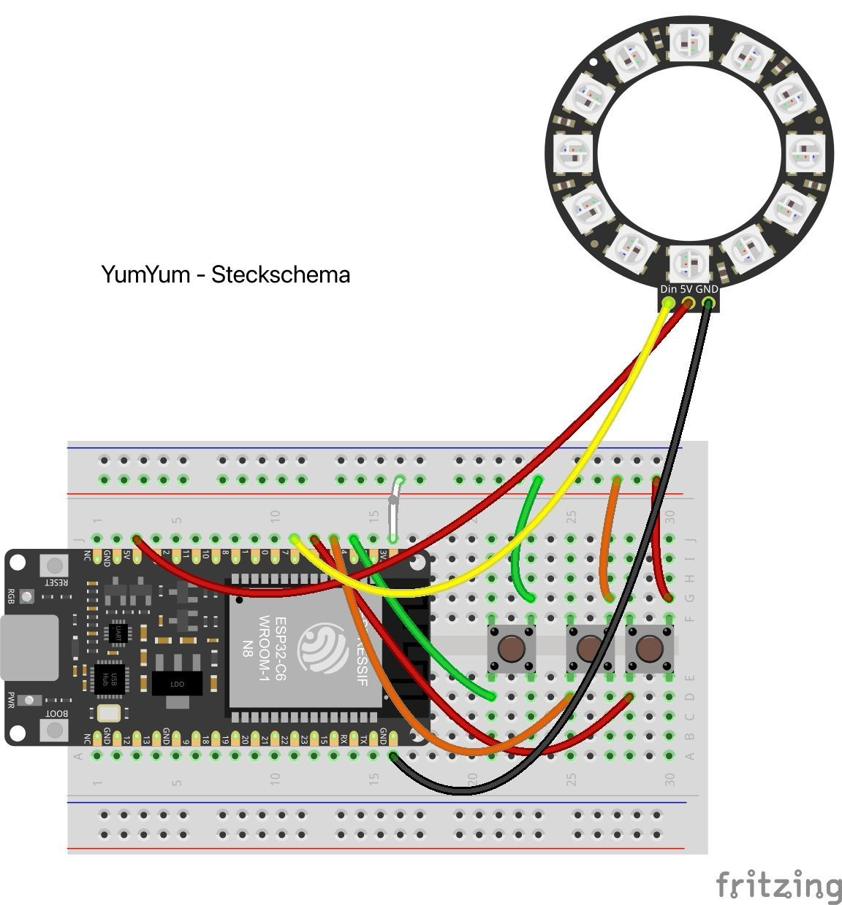

## Kurzbeschreibung des Projekts

•⁠  ⁠*Modul:* Interaktive Medien 4 an der Fachhochschule Graubünden (FS26)  
•⁠  ⁠*Themenfeld:* IoT-Applikation zum Thema Eltern mit kleinen Kindern  
•⁠  ⁠*Name des Projekts:* YumYum Feedback  
•⁠  ⁠*Team Physical Computing:* Lorena Simonelli & Sheyla Spiess
•⁠  ⁠*Team WebApp:* Aarti Miescher & Tamara Kae Marzan
 
 
* Welches Problem im Alltag von Eltern mit kleinen Kindern wird gelöst?*
In Kitas und Familien ist es oft schwierig, objektives Feedback von Kleinkindern zum Essen zu erhalten. Verbale Kommunikation ist in diesem Alter oft unpräzise, und die tatsächliche Akzeptanz von Mahlzeiten bleibt für Eltern und Küchenpersonal unklar. Dies führt zu unnötigem Food Waste, da die Menüplanung nicht optimal auf die Bedürfnisse der Kinder abgestimmt ist.

* Was ist der „Sinn und Zweck“ des Systems?*
YumYum Feedback ist ein interaktives Feedbacksystem, das die Lücke zwischen kindlicher Erfahrung und erwachsener Datenanalyse schliesst. Durch ein haptisches Eingabegerät können Kinder spielerisch und autonom ihr Essen bewerten. Diese Daten werden digital aufbereitet, um die Kommunikation zwischen Kindern, Betreuungspersonen und Küche zu verbessern und Abfälle gezielt zu reduzieren.

\[Bilder / GIFs (optional)\]

### UX & Konzeption

In diesem Teil werden die gemeinsamen Schritte aus der UX-Abgabe dokumentiert, damit sich hier alles vollständig an einem Ort befindet (betrifft WebApp und Physical Computing)

•⁠  ⁠*Figma:* https://www.figma.com/design/duhxVGTsO6L7Tl17rjWYhk/IM-4-%E2%80%93-App-Konzeption-Vorlage--Copy-?node-id=97-1136&t=HTVwNsrONgHQfIB7-1
•⁠  ⁠*User Flow \+ Screen Flow*

•⁠  ⁠Welche Features waren angedacht?
•⁠  ⁠Echtzeit-Feedback: Visuelle Bestätigung am Gerät (LEDs) nach der Stimmabgabe.
•⁠  ⁠Dashboard für Erwachsene: Visualisierung der Beliebtheit von Speisen über Zeiträume hinweg.
•⁠  ⁠Daten-Schnittstelle: Automatisierte Übertragung der Klicks vom ESP32 an die Web-Datenbank.

•⁠  ⁠Welche Features wurden nicht umgesetzt? (Warum)
•⁠  ⁠Drei grosse, robuste Buttons mit visuellen Icons. Wir haben uns für Schraubtaster entschieden. 
•⁠  ⁠RFID-Identifikation: Wurde verworfen, um die Anonymität zu wahren und den Fokus auf das Gesamtfeedback der Gruppe zu legen (Datenschutz in Kitas).

### Setup

•⁠  ⁠*WebApp:* [Link zur Website](https://im4.potterai.ch/)  
•⁠  ⁠*Video-Dokumentation:* [Link zum Video auf Youtube](XXXXXXXXXXXX) 

#### Installationsanleitung WebApp (AARTI + KAE)

**verständliche* Schritt-für-Schritt-Anleitung für Aussenstehende, um das Projekt zu klonen und auf einem eigenen Server zu installieren*

1.⁠ ⁠Was benötige ich an Infrastruktur?  
2.⁠ ⁠Was muss ich auf meinem Webserver installieren?  
3.⁠ ⁠Wie kann ich die Datenbank importieren?  
4.⁠ ⁠Wo muss ich die DB-Credentials eintragen?  
5.⁠ ⁠…  
6.⁠ ⁠Wie nehme ich das physische Artefakt in Betrieb?

#### Bauanleitung Physical Computing (Lorena + Sheyla)

•⁠  ⁠**Was muss ich wie bauen, verbinden, installieren?**  
•⁠  ⁠ergänze: **Komponentenplan* (betrifft Physical Computing, vgl. Slides Kapitel 15): Schaubild enthält*  
  * die eingesetzten Komponenten  
  * die verbundenen Sensoren und Aktoren  
  * die Programme (mit Dateinamen)  
  * die Kommunikationswege  
•⁠  ⁠ergänze: **Steckplan* (betrifft Physical Computing, vgl. Slides Kapitel 15): generiert z.B. mit Fritzing (empfohlen), Tinkercad, Wokwi*  
  * beachtet die [Fritzing Parts](https://github.com/Interaktive-Medien/im_physical_computing/tree/main/15_Intro_Projektdoku) extra für euch  
•⁠  ⁠ggf. **Bildmaterial**

## technische Details

// Hier sollte das Verständnis ersichtlich sein / Wie stehen die Dateien in Beziehung zueinander, Wie reden Die Dateien miteinander, Wie ist der Weg der Daten

•⁠  ⁠*Projektstruktur / Code-Struktur:* \[Hinweis: Der Code selbst muss im Repository liegen und im Kopfbereich jeder Datei eine kurze Zusammenfassung enthalten.\]  
•⁠  ⁠*Datenschnittstelle: \[*zwischen WebApp und Physical Computing\]  
•⁠  ⁠*ERM:* \[Erklärung und Schaubild\]  
•⁠  ⁠*Authentifizierung:* \[Erklärung\]

## Known bugs

•⁠  ⁠Was funktioniert noch nicht einwandfrei?  
•⁠  ⁠Was ist uns aufgefallen bei der Entwicklung?  
•⁠  ⁠Was könnte noch verbessert werden?

## Umsetzungsprozess

•⁠  ⁠*Reflexion / Erfahrung / Lernfortschritt:* Was haben wir gelernt? Würden wir es nochmal genauso machen? Was war gut, was war schlecht?  
•⁠  ⁠*Herausforderungen & Lösungen:* \[Verworfene Ansätze, Fehler, Umplanungen\]  
•⁠  ⁠*KI-Einsatz:* Dokumentation der verwendeten KI-Tools und deren Nutzen (KI ist nicht verboten)  
•⁠  ⁠*Fazit:* …