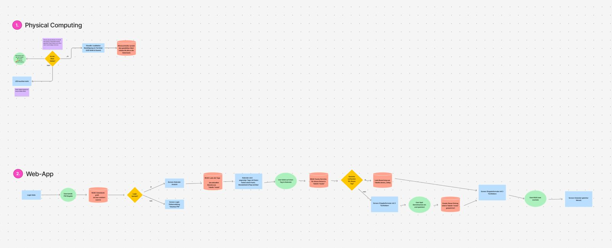

## Kurzbeschreibung des Projekts

•⁠  ⁠*Modul:* Interaktive Medien 4 an der Fachhochschule Graubünden (FS26)  
•⁠  ⁠*Themenfeld:* IoT-Applikation zum Thema Eltern mit kleinen Kindern  
•⁠  ⁠*Name des Projekts:* YumYum Feedback  
•⁠  ⁠*Team Physical Computing:* Lorena Simonelli & Sheyla Spiess  
•⁠  ⁠*Team WebApp:* Aarti Miescher & Tamara Kae Marzan

**Welches Problem im Alltag von Eltern mit kleinen Kindern wird gelöst?**
In Kitas und Familien ist es oft schwierig, objektives Feedback von Kleinkindern zum Essen zu erhalten. Verbale Kommunikation ist in diesem Alter oft unpräzise und die tatsächliche Akzeptanz von Mahlzeiten bleibt für Eltern und Küchenpersonal unklar. Dies führt zu unnötigem Food Waste, da die Menüplanung nicht optimal auf die Bedürfnisse der Kinder abgestimmt ist.

**Was ist der „Sinn und Zweck“ des Systems?**
YumYum Feedback ist ein interaktives Feedbacksystem, das die Lücke zwischen kindlicher Erfahrung und erwachsener Datenanalyse schliesst. Durch ein haptisches Eingabegerät können Kinder spielerisch und autonom ihr Essen bewerten. Diese Daten werden digital aufbereitet, um die Kommunikation zwischen Kindern, Betreuungspersonen und Küche zu verbessern und Abfälle gezielt zu reduzieren.

### UX & Konzeption

In diesem Teil werden die gemeinsamen Schritte aus der UX-Abgabe dokumentiert, damit sich hier alles vollständig an einem Ort befindet (betrifft WebApp und Physical Computing)

•⁠  ⁠*Figma:* https://www.figma.com/design/duhxVGTsO6L7Tl17rjWYhk/IM-4-%E2%80%93-App-Konzeption-Vorlage--Copy-?node-id=97-1136&t=HTVwNsrONgHQfIB7-1
•⁠  ⁠*User Flow + Screen Flow:* 
•  *User Flow + Screen Flow Figma:* https://www.figma.com/board/qWYjUfc9T2vbG6PxpmFnCn/USER-FLOW?node-id=0-1&t=qyvtniZ1g1mnqeoW-1

•⁠  ⁠*Welche Features waren angedacht?*
  * Echtzeit-Feedback: Visuelle Bestätigung am Gerät (LEDs) nach der Stimmabgabe.
  * Dashboard für Erwachsene: Visualisierung der Beliebtheit von Speisen über Zeiträume hinweg.
  * Daten-Schnittstelle: Automatisierte Übertragung der Klicks vom ESP32 an die Web-Datenbank.

•⁠  ⁠*Welche Features wurden nicht umgesetzt? (Warum)*
  * Drei grosse, robuste Buttons mit visuellen Icons: Wir haben uns im Prozess für mechanisch Metall-Schraubtaster entschieden. Die farbliche Zuordnung wird über das grafische Interface des Gehäuses gelöst.
  * RFID-Identifikation: Wurde verworfen, um die Anonymität zu wahren und den Fokus auf das Gesamtfeedback der Gruppe zu legen (Datenschutz und vereinfachte Handhabung in Kitas).

---

### Setup

•⁠  ⁠*WebApp:* [Link zur Website](https://im4.potterai.ch/)
•⁠  ⁠*Video-Dokumentation:* [Link zum Video auf Youtube](XXXXXXXXXXXX) 

#### Installationsanleitung WebApp (AARTI + KAE)

#### Infrastruktur

Folgende Infrastruktur wird benötigt:
•    Ein Webserver oder ein Webhosting mit PHP-Unterstützung, z.B. über Infomaniak
•    Eine MySQL-Datenbank
•    HTTPS ist empfohlen, weil die WebApp mit Benutzer-Login und Sessions arbeitet.

Geeignet ist zum Beispiel ein klassisches Hosting mit PHP 8.0+ oder höher und einer MySQL-Datenbank.

#### Installation Webserver

Auf dem Webserver müssen PHP und die MySQL-Anbindung für PHP installiert sein, weil die API-Dateien wie  login.php und gericht_erfassen.php die Konfiguration aus im4/system/config.php  laden und über PDO mit der Datenbank arbeiten.
Danach das Projekt bzw. Repository auf den Server kopieren und klonen und die Ordnerstruktur beibehalten.

#### Import Datenbank

Die Datenbank kann man mit phpMyAdmin importieren. Im Projekt gibt es laut Struktur eine  im4/system/db.sql, ausserdem existieren einzelne SQL-Dateien für Tabellen wie Benutzer, Gerichte und Organisationen.

#### Eintrag DB-Credentials

Die Datenbank-Zugangsdaten müssen in im4/system/config.php eingetragen werden.
Dort werden typischerweise diese Werte gesetzt:
Datenbank-Host
Datenbankname
Benutzername
Passwort

#### Inbetriebnahme Device

Für die Inbetriebnahme des physischen Artefakts muss das Gerät mit der WebApp bzw. dem Server verbunden werden, damit es Daten an die Datenbank senden oder von dort abrufen kann. In deiner Projektstruktur ist bereits eine Tabelle für Geräte und eine Tabelle für gerätebezogene Bewertungsdaten vorgesehen. Ausserdem wird bei neuen Gerichten mit IDs gearbeitet, damit Bewertungen später einem Gericht zugeordnet werden können.

Das grundsätzliche Vorgehen ist:
1. Das physische Gerät mit Strom versorgen.
2. Das Gerät mit dem Netzwerk verbinden, damit es den Webserver erreichen kann.
3. Das Gerät so konfigurieren, dass es die korrekte Server-URL und die zugehörige Gerätekennung verwendet.
4. Prüfen, ob das Gerät in der Datenbank als “device” eingetragen ist.
5. Testweise Daten senden und kontrollieren, ob diese in der Datenbank ankommen.

#### Bauanleitung Physical Computing (Lorena + Sheyla)

Was muss ich wie bauen, verbinden, installieren?
Wir müssen es schaffen, dass ein haptischer Tastendruck am Terminal fehlerfrei registriert wird, der integrierte LED-Ring darauf visuell reagiert und das entsprechende Feedback-Signal per WLAN an die Web-Datenbank übermittelt wird. Das Signal muss dann einer Device-ID und einem Status zugewiesen werden, damit es für die Menüplanung weiterverarbeitet werden kann.

*Komponentenplan*

Die eingesetzten Komponenten:

•⁠  ⁠Mikrocontroller-Board: ESP32-C6 N8 ← Verarbeitet die Eingangssignale der Taster, steuert den LED-Ring und sendet sie über das integrierte WLAN-Modul an den Webserver.
•⁠  ⁠Eingabe-Elemente: 3x Metall-Drucktaster ← Mechanisch Schraubtaster, welche die Interaktion der Kinder abfangen.
•⁠  ⁠Visuelle Ausgabe: WS2812B RGB-LED-Ring ← 12-Segment-Ring, der im Standby als dreigeteilte Ampelanzeige dient und bei Klick eine optische Bestätigung ausgibt.
•⁠  ⁠Stromversorgung: USB-Kabel mit 5V ← Liefert die nötige elektrische Energie für den stabilen Betrieb der Hardware und des LED-Rings.
•⁠  ⁠Prototyping-Plattform: Steckplatte ← Ermöglicht das lötfreie Aufstecken, Fixieren und elektrische Verschalten der Bauteile.
•⁠  ⁠Verbindungsleitungen: Jumperkabel ← Verbinden die Pins der Komponenten flexibel mit der Steckplatte.

Visualisierung Komponentenplan: 

Die verbundenen Sensoren und Aktoren:

Sensoren:
•⁠  ⁠3x Metall-Drucktaster: Fungieren als digitale Sensoren. Sie schliessen bei Betätigung den Stromkreis und legen ein Schaltsignal an den jeweiligen GPIO-Pin, sobald ein Kind abstimmt.

Aktoren:
•⁠  ⁠WS2812B LED-Ring (12 Segmente): Fungiert als physischer Aktor. Gesteuert durch die Datei mc.ino setzt er die Programmbefehle in eine physikalische Aktion um, indem er die passende Lichtfarbe (Grün, Gelb, Rot) als direktes Feedback aufleuchten lässt.

Die Programme (mit Dateinamen):

•⁠  mc.ino ← Läuft als Firmware direkt auf dem ESP32-C6. Diese Datei überwacht die GPIO-Pins der drei Taster, entprellt die Signale elektronisch, steuert den RGB-LED-Ring für das optische Feedback an und schickt die Bewertung drahtlos per WLAN an den Server.
•⁠ api/load.php ← Die Empfänger-Schnittstelle (API) auf dem Server. Sie nimmt den HTTP-POST-Request und die JSON-Daten des ESP32 entgegen, liest die Bewertung aus und schreibt sie per SQL-INSERT in die Tabelle gericht_device_zeit.
•⁠ system/config.php ← Die zentrale Konfigurationsdatei. Sie beinhaltet die Zugangsdaten für das Datenbanksystem und stellt die PDO-Verbindung (Datenbank-Brücke) für alle anderen PHP-Skripte sicher zur Verfügung.
•⁠ api/gericht_erfassen.php ← Verarbeitet die Formulareingaben der Erzieher. Wenn ein neues Menü eingetippt wird, nimmt diese Datei die Daten an und speichert sie in der Tabelle gerichte.
•⁠ api/woche.php & api/gerichte.php ← Die Auswertungs-Schnittstellen. Sie holen die Gerichte und die dazugehörigen Klicks aus der Datenbank, rechnen die Ampel-Bewertungen mathematisch zusammen und liefern das Ergebnis als JSON-Daten an das Frontend.
•⁠ dashboard.html & gerichte.html ← Die eigentlichen Weboberflächen (Frontend) für das Kitapersonal. Sie beinhalten keine PHP-Logik, sondern nutzen die JavaScript-Dateien (js/dashboard.js und js/gerichte.js), um die Daten asynchron vom Server zu laden und als Kalender oder Prozentbalken anzuzeigen.

Die Kommunikationswege:

Metall-Drucktaster ⇄ Microcontrollerboard ESP32-C6-N8
•⁠  ⁠Weg: Kabelgebunden über die Jumperkabel auf der Steckplatte
•⁠  ⁠Protokoll: Digitales Schaltsignal (3.3V über INPUT_PULLDOWN-Schaltung)
•⁠  ⁠Daten: Der Tastendruck aktiviert den jeweiligen GPIO-Pin (4 = Gut, 5 = Neutral, 6 = Schlecht)

Microcontrollerboard ESP32-C6-N8 ⇄ WS2812B LED-Ring
•⁠  ⁠Weg: Kabelgebunden über ein Daten-Jumperkabel auf der Steckplatte
•⁠  ⁠Protokoll: Serielles Einleiter-Busprotokoll (NeoPixel-Schnittstelle über GPIO 7)
•⁠  ⁠Daten: Befehle zur Farbcodierung und Helligkeitssteuerung der 12 RGB-Segmente

ESP32-C6-N8 ⇄ Webserver / API (load.php)
•⁠  ⁠Weg: Drahtlos über das lokale WLAN-Netzwerk an das Internet/Backend
•⁠  ⁠Protokoll: Das ESP32-Board sendet die Daten per HTTP-POST an die Schnittstelle load.php, welche die Werte direkt in die Tabelle gericht_device_zeit einträgt
•⁠  ⁠Daten: JSON-Payload bestehend aus der Gerätekennung und der Bewertung {"device_id": 1, "status": 0/1/2}

Datenbank ⇄ Frontend (Benutzeroberfläche)
•⁠ Weg: Interner Server- und Netzwerkdatenfluss über asynchrone HTTP-Anfragen.
•⁠ Protokoll: Die Frontend-Skripte `js/dashboard.js` und `js/gerichte.js` fordern die Daten über `fetch()` (HTTP-GET) von den serverseitigen Schnittstellen `api/woche.php` und `api/gerichte.php` an.
•⁠ Daten: Die PHP-Schnittstellen lesen die Daten aus den MySQL-Tabellen (`gerichte` und `gericht_device_zeit`) aus, verknüpfen sie über einen SQL-Join und übergeben das Ergebnis als strukturiertes JSON-Payload an den Browser. Das JavaScript verarbeitet diese Daten (z. B. Berechnung der Prozentbalken für 👍, 😐, 👎) und stellt die Ergebnisse dynamisch im Betreuer-Kalender sowie auf den Feedback-Karten dar.

Steckplan  

---

## technische Details (Kae & Aarti)

In diesem Abschnitt wird die softwareseitige Architektur, die Datenbeziehung und der genaue Kommunikationsfluss zwischen dem physischen Terminal (Physical Computing) und der Web-App (Backend/Frontend) aufgeschlüsselt.

### Projektstruktur / Code-Struktur

Der Code ist als klassische PHP/JavaScript-Web-Applikation aufgebaut und wird über SFTP auf einem externen Infomaniak-Server deployed. Die Verzeichnisstruktur folgt einer klaren Trennung zwischen Frontend und Backend: Im Ordner `api/` liegen alle serverseitigen PHP-Endpunkte (`login.php`, `logout.php`, `register.php`, `protected.php`, `gerichte.php`, `gericht_erfassen.php`, `woche.php`). JavaScript-Files befinden sich im Ordner `js/`, Stylesheets in `css/` und die Datenbankverbindung sowie Konfiguration in `im4/system/config.php`. Die HTML-Seiten (`index.html`, `login.html`, `register.html`, `protected.html`, `gerichte.html`) liegen im Root-Verzeichnis. Die SFTP-Verbindungskonfiguration für das Deployment via Visual Studio Code ist in `.vscode/sftp.json` hinterlegt.

Als Technologie-Stack kommen HTML, CSS und JavaScript mit der Fetch API im Frontend zum Einsatz. Das Backend basiert auf PHP mit JSON-Responses, die Datenbank auf MariaDB, gehostet bei Infomaniak. Das Deployment erfolgt manuell per SFTP-Extension in Visual Studio Code.

Die Struktur wurde so gewählt, weil sie eine klare Trennung zwischen Frontend (HTML, CSS, JS) und Backend (PHP-API) schafft und damit die Übersicht und Wartbarkeit des Codes vereinfacht. Da jede Seite ein eigenes JavaScript-File besitzt, lassen sich Fehler schnell einem bestimmten Bereich zuordnen, ohne dass man sich durch eine grosse, zusammenhängende Codebasis arbeiten muss.

YumYum-Feedback/
│
├── index.php                 # Startseite / Login-Maske für Betreuungspersonen
├── dashboard.php             # Hauptseite: Auswertung der Menü-Akzeptanz (Kalenderansicht)
├── load.php                  # API: Empfängt JSON-Daten vom Terminal und schreibt sie in die DB
│
├── css/
│   ├── style.css             # Allgemeines Layout und Design der Web-App
│   └── dashboard.css         # Spezifische Styles für die Kalender- und Diagramm-Visualisierung
│
├── api/
│   ├── auth/
│   │   ├── login.php         # Verarbeitet den Login der Betreuungspersonen
│   │   ├── logout.php        # Beendet die Session und meldet den User ab
│   │   └── check_auth.php    # Prüft den Session-Status ("Bin ich eingeloggt?")
│   │
│   └── ratings/
│       └── get_monthly.php   # Lädt die aggregierten Abstimmungsdaten für den Dashboard-Kalender
│
├── system/
│   ├── config.php            # Zentrale Datenbank-Zugangsdaten (In .gitignore hinterlegt!)
│   └── db_structure.sql      # SQL-Dump für die Tabellenstruktur
│
└── mc.ino
                              # ESP32-C6 Firmware (WLAN-Anbindung, Debounce, Spam-Schutz & HTTP-POST)

### Datenschnittstelle (Weg der Daten)
•⁠  ⁠*Physical Computing:* Ein Kind drückt einen Metall-Taster $\rightarrow$ Der ESP32-C6 validiert den Klick (Entprellung + Spam-Schutz) $\rightarrow$ Der Controller generiert mittels ⁠ Arduino_JSON ⁠ die Payload und sendet einen ⁠ HTTP-POST ⁠-Request mit dem Header ⁠ Content-Type: application/json ⁠ an das Backend.
•⁠  ⁠*WebApp:* Die API-Schnittstelle ⁠ load.php ⁠ nimmt den Request entgegen, decodiert den JSON-String per ⁠ json_decode() ⁠ und speichert die Daten persistent per SQL-⁠ INSERT ⁠ in die Datenbank.

### Known Bugs

Im ursprünglichen Fritzing-Steckplan (Steckschema.jpeg) wurden die Taster gegen GND verdrahtet und der LED-Ring fälschlicherweise über einen GPIO-Pin gespeist. Beim realen Prototypen-Bau wurde dies korrigiert: Die Taster hängen an 3.3V (wegen INPUT_PULLDOWN) und der LED-Ring wird stabil über den 5V-Pin (VBUS) versorgt.

